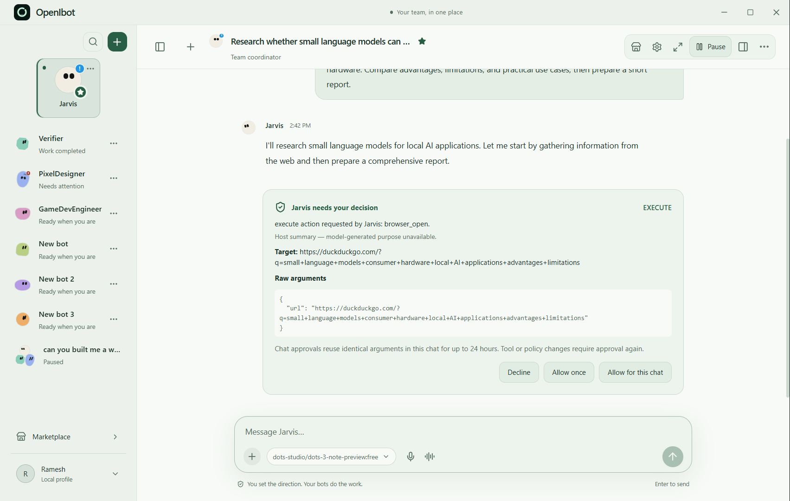
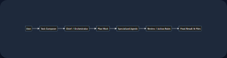
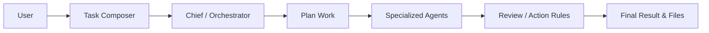
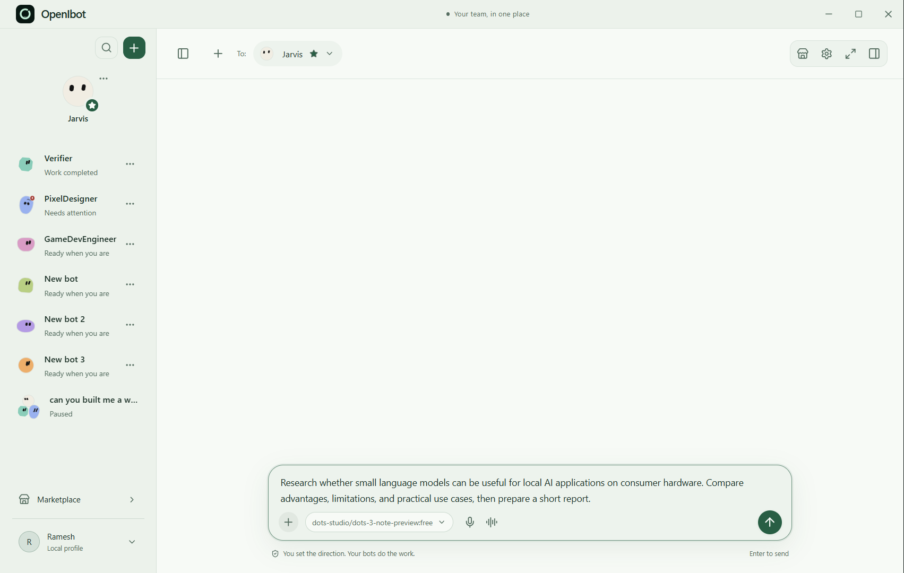
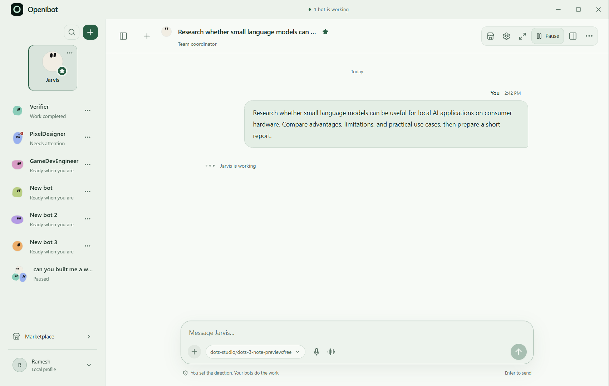
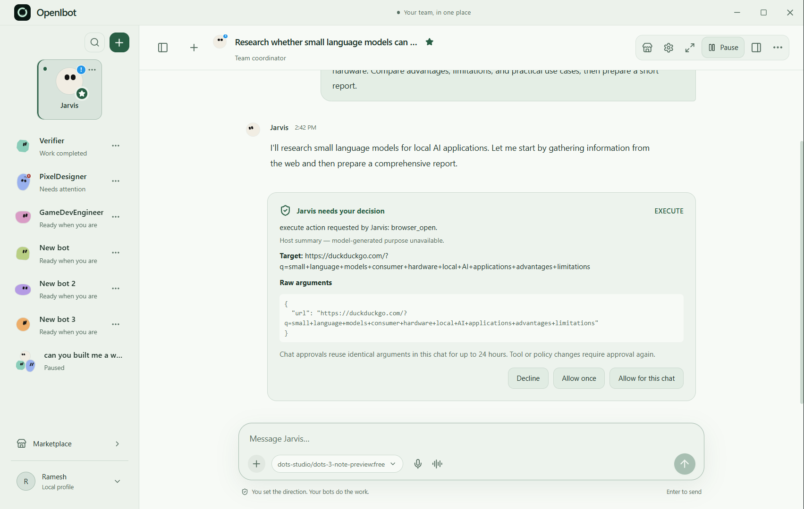

<div align="center">
  
  <h1>OpenIbot</h1>
  <p><strong>Open-source multi-model AI agent workspace.</strong></p>
  <p>One workspace. Multiple AI models. Specialized agents working together.</p>

  <a href="https://github.com/rameshio/OpenIbot/actions"></a>
  <a href="https://github.com/rameshio/OpenIbot/blob/main/LICENSE"></a>
  <a href="https://www.typescriptlang.org/"></a>
  <a href="https://github.com/rameshio/OpenIbot"></a>

  <br />
  
</div>

<br />

Give OpenIbot a task, choose your AI model, and watch specialized agents plan, collaborate, review, and produce the final result.

---

## 🚀 Features

- **Multi-Agent Teams:** Direct multiple bots in group chats, each with its own role and memory.
- **Isolated Linux Workspaces:** Every agent gets a secure, private Linux computer via Docker for browsing, terminal execution, and file manipulation.
- **Animated Avatars:** Your agents have customizable appearances and animated identities.
- **Workflow Teaching:** Record pointer and navigation steps to teach bots reusable skills.
- **Action Review:** Approve or decline a bot's planned actions before they happen.
- **Scheduled Routines:** Set up background agents to perform tasks automatically.

---

## ⚙️ How OpenIbot Works

1. **Describe your task:** Tell OpenIbot what you want accomplished in the Task Composer.
2. **Choose an AI model:** Select a provider connection (e.g., OpenAI, Claude, local LLMs).
3. **OpenIbot plans the work:** The Chief orchestrator breaks the task into steps and brings in specialized agents.
4. **Agents work:** The assigned agents do the heavy lifting using tools, files, and browsers.
5. **Review:** The work is reviewed and synthesized.
6. **Final result:** OpenIbot presents the completed work.

<div align="center">
  
</div>



---

## See OpenIbot in Action

### 1. Give OpenIbot a task



Describe your goal, choose a model, attach files or tools when needed, and start the task.

### 2. Agents get to work



OpenIbot coordinates the agents involved in the task and lets you inspect their progress in the chat and agent sidebar.

### 3. Review the result



Review the completed result. Files generated by the agents are saved in their isolated Linux computer workspaces, accessible via the Bot Details panel.

*Note: Graph visualization of multi-agent workflows is currently **Planned/Experimental** and will be added in a future release.*

---

## 🧠 Supported AI Models

OpenIbot works with a variety of providers through native connections and OpenAI-compatible endpoints.

| Provider | Status | Notes |
|---|:---:|---|
| OpenAI | ✅ | Native API integration |
| Anthropic | ✅ | Claude 3+ models |
| Google | ✅ | Gemini models |
| xAI | ✅ | Grok models |
| Groq | ✅ | Fast inference endpoints |
| DeepSeek | ✅ | Supported via compatible APIs |
| Mistral | ✅ | Supported via compatible APIs |
| Cohere | ✅ | Supported via compatible APIs |
| OpenRouter | ✅ | Full catalog support |
| Local Servers | ✅ | LM Studio, Ollama, vLLM |

*Note: You must bring your own API keys. All keys are encrypted safely on your device using native OS secret storage and are never sent anywhere except to the providers you configure.*

---

## 🏗 Architecture

OpenIbot is built entirely locally as an Electron desktop app with Docker integration.

- **Frontend (Renderer):** Built with React, Vite, and Lucide Icons. Manages the chat, UI, and noVNC viewing for agent workspaces.
- **Backend (Main Process):** Electron main process handles OS integrations, secret management via `safeStorage`, agent orchestration, tool execution, and local database handling.
- **Docker Workspaces:** Uses Docker to dynamically provision fully isolated Linux desktops. The bots interact with the system via internal bridges.
- **Memory & Tools:** Agents access robust tool suites including shell, browser automation, file I/O, and semantic memory search.

---

## 🚦 Project Status

**Alpha**

OpenIbot is under active development. While the core orchestration and Docker integrations are functional, APIs, workflows, and interfaces may change significantly as the project evolves. Expect bugs and please review agent actions carefully!

---

## 🗺 Roadmap

- [ ] Additional native provider integrations
- [ ] Improved agent orchestration protocols
- [ ] Expanded tool/plugin ecosystem
- [ ] Better workflow persistence across restarts
- [ ] Enhanced graph visualization for multi-agent logic
- [ ] Refined local and private inference experiences

---

## 💻 Getting Started

### Prerequisites
- **Windows** (Current focus)
- **Node.js** v20+
- **Docker Desktop** (Must be running with the Linux engine)

### Installation

1. **Clone the repository:**
   ```bash
   git clone https://github.com/rameshio/OpenIbot.git
   cd OpenIbot
   ```
2. **Install dependencies:**
   ```bash
   npm install
   ```
3. **Environment Setup:**
   ```bash
   cp .env.example .env.local
   ```
   Open `.env.local` and set a strong `IBOT_LOCAL_PASSWORD` (at least 16 characters). 

4. **Start Development Server:**
   ```bash
   npm run dev
   ```

### Production Build
```bash
npm run build
npm run package
```
*The output executable will be created in `release/`.*

---

## 🤝 Contributing

We welcome contributions! See [CONTRIBUTING.md](CONTRIBUTING.md) for details on setting up your environment and submitting Pull Requests.

## 🔒 Security

For security information and how to report vulnerabilities, please read our [Security Policy](SECURITY.md).

## 📄 License

This project is licensed under the MIT License - see the [LICENSE](LICENSE) file for details.
