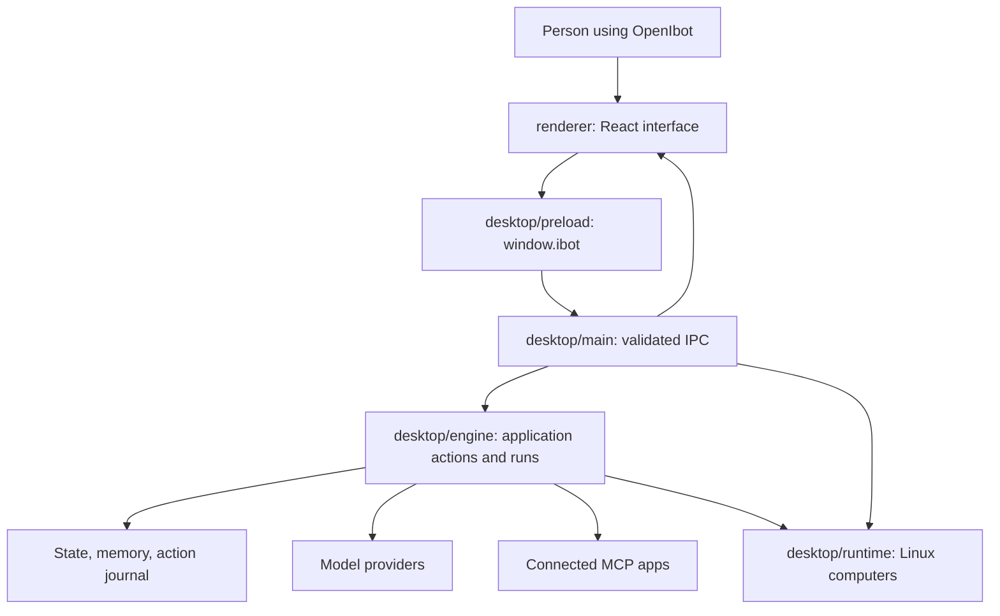

# 02 — Architecture and startup

## The application that runs today

[package.json](../../package.json) declares `dist-desktop/main.cjs` as the executable entry. [scripts/build.mjs](../../scripts/build.mjs) builds Electron main and preload bundles with esbuild, then builds the React renderer with Vite. [vite.config.mts](../../vite.config.mts) selects `renderer/` as the interface root. The older `src/` Next.js application is retained but is outside this desktop build and the current TypeScript include list.

## Layers and their responsibilities

The renderer displays data and collects input. Preload exposes a small bridge named `window.ibot`. IPC means inter-process communication: a message from the interface to the native process. Main validates the sender and command. The engine coordinates bots and state. Runtime controls Docker computers. Shared files describe data used by both sides.

## Startup, step by step

1. [main.ts](../../desktop/main.ts) registers the `ibot:` protocol, sets the displayed name to OpenIbot while retaining the Windows ID `app.ibot.desktop`, pins both the saved profile and browser session to the legacy `I Bot` folder (or `IBOT_DATA_DIR` when supplied), and acquires a single-instance lock.
2. When Electron is ready, main determines the data and resource directories and creates the runtime and engine.
3. The engine loads saved state, memory, and the action journal. Storage recovery normalizes interrupted work rather than silently resuming it.
4. Main serves packaged renderer assets through `ibot://app`; development uses the Vite address selected by the development script.
5. Main creates a `BrowserWindow`, attaches preload, installs IPC handlers, sets native permissions, and creates the tray controls.
6. [renderer/main.tsx](../../renderer/main.tsx) renders `App` and imports the application styles.
7. [App.tsx](../../renderer/App.tsx) subscribes to state changes and requests the initial state through the bridge. Its boot screen lasts until that state is available.

## The bridge in plain language

[preload.ts](../../desktop/preload.ts) uses `contextBridge.exposeInMainWorld('ibot', api)`. The interface gets `invoke`, state/log/voice-stop subscriptions, and window controls. Each subscription returns a cleanup function that removes its event listener. Renderer code does not receive unrestricted Node.js access.

Main allows specific command names and rejects unknown names, invalid argument objects, oversized inputs, or calls from an unexpected frame. Native actions such as file picking and window control live in main; bot actions such as `chat.send` go to the engine. This separation is why a UI component usually calls a command instead of directly opening a file or Docker process.

## Closing and quitting

When close-to-tray is enabled, closing the window hides it and leaves the process running. The tray can show the window or quit the app. Quitting invokes shutdown handling. Schedules require the process to remain active; this application does not make the Windows computer or a cloud service run continuously.

## When changing architecture

A new command may need matching changes in `shared/types.ts`, preload, main's allowlists/dispatch, the engine, and its caller. Trace the entire path. Update this diagram if responsibilities move. A build entry change also affects [the build guide](12-build-and-testing.md).
