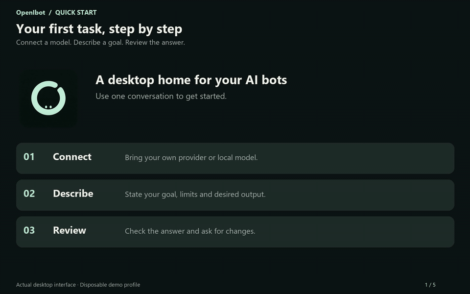
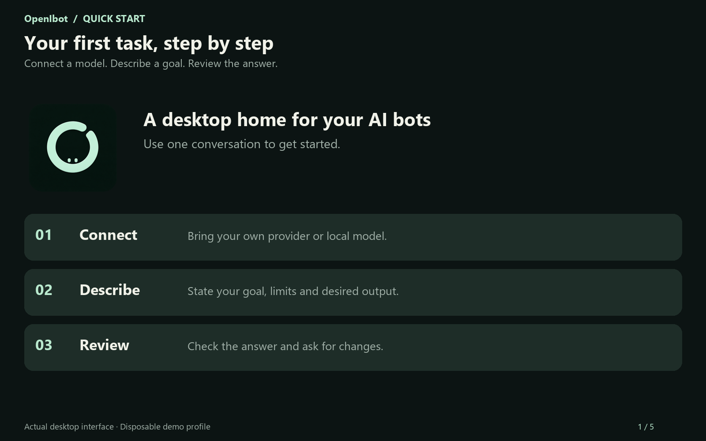
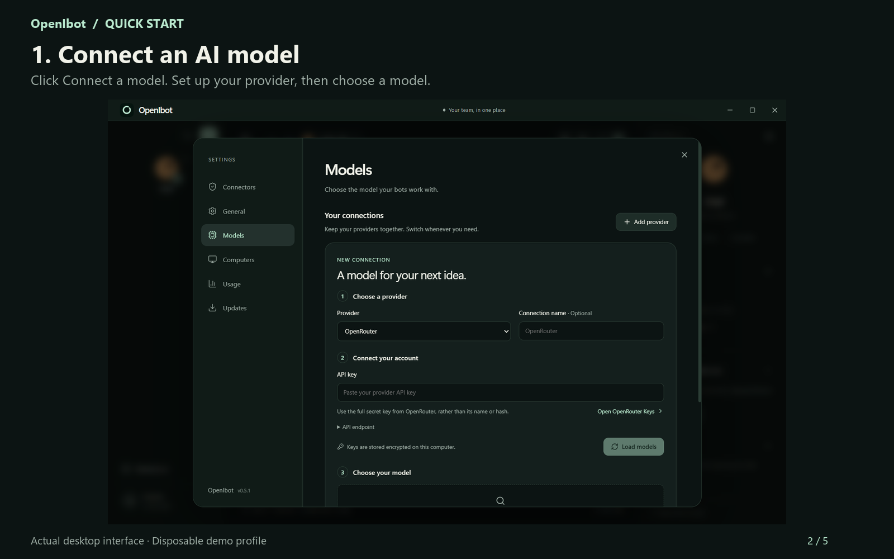
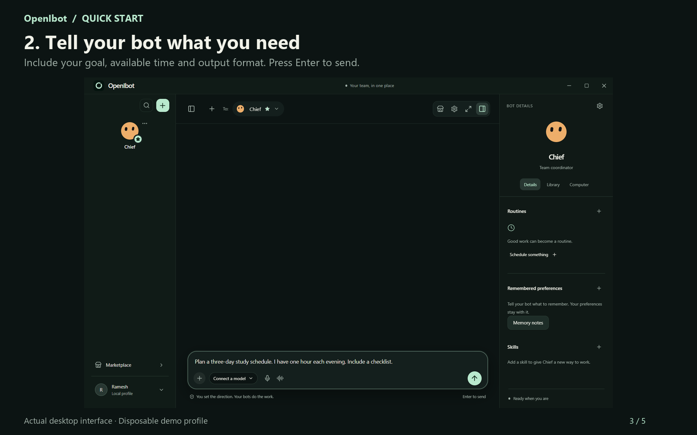
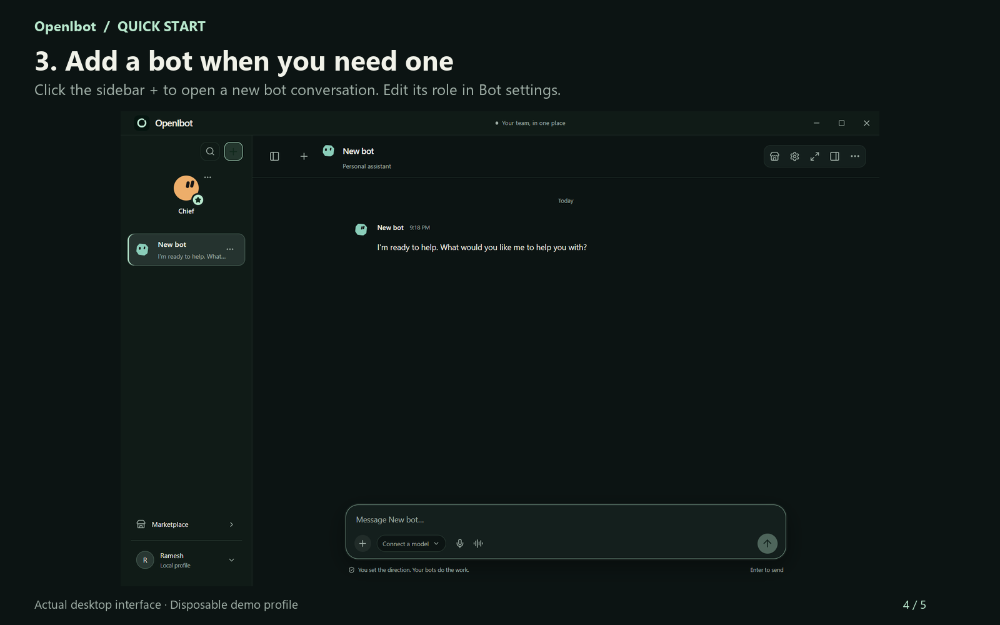
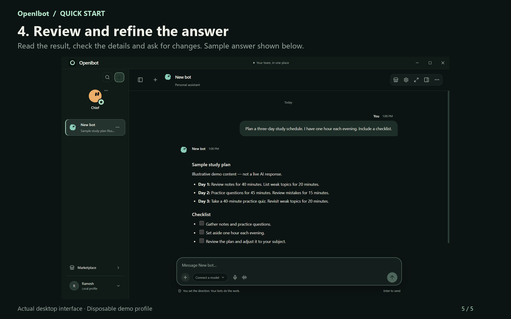

# OpenIbot in 30 seconds

Start with one bot and one clear task. The video and images below show the current desktop interface.

[Download the 30-second demo (MP4)](assets/demo/openibot-demo.mp4?raw=true)

This animated preview plays directly in the guide. The MP4 download opens in a browser or media player after saving; a GitHub repository file page is not the playback link.



The video is silent, with captions on every scene. The model setup, composer and new-bot greeting are actual interface captures. The final study plan is clearly marked **illustrative demo content**, not a live AI response. No provider request or Docker computer is started for these captures.



## 1. Connect a model

Click **Connect a model**. Select a provider or local endpoint, supply its connection details, discover the available models and save your selection. An API key is required when your provider requires one. This demo leaves the connection empty; it does not demonstrate a successful provider connection.



## 2. Describe your task

Tell the bot what you want, any limits, and what the answer should look like. For example: “Plan a three-day study schedule. I have one hour each evening. Include a checklist.” With a model connected, press **Enter** or click the send arrow. Use **Shift+Enter** for a new line. Review any requested action approvals as they appear.



## 3. Add another bot when useful

The sidebar **+** opens a new bot conversation with a saved greeting. It does not need a model request to create the bot. Use **Bot settings** to change its name, role and instructions. A role is the kind of help you want that bot to provide.



## 4. Review the answer

Read the result, check important details and ask for changes in the same conversation. The study plan below illustrates how an answer is displayed. It was written for this demo rather than generated by a connected model.



## Recreate these media

From the repository root, run:

```powershell
npm run build
node scripts/create-demo.mjs
python scripts/render-demo.py
```

Capture requires the project's Playwright and Electron dependencies. Rendering requires Python with Pillow, Windows Segoe UI fonts, and FFmpeg on PATH. The capture script creates and closes its own temporary desktop profile, removes that specific temporary directory, and writes four source screenshots under `docs/assets/demo/`. Rendering turns those screenshots into five guide images and a 30-second H.264 MP4. H.264 is a common video encoding format; this MP4 uses it for browser and media-player compatibility.

Use a current FFmpeg build with the `zoompan` filter. If PATH selects an older version, set `$env:FFMPEG_BINARY` to the full path of a current FFmpeg executable before rendering.

The media are documentation assets. They do not add an in-app tutorial or change the installed application. Generated screenshots may need refreshing after interface changes.
