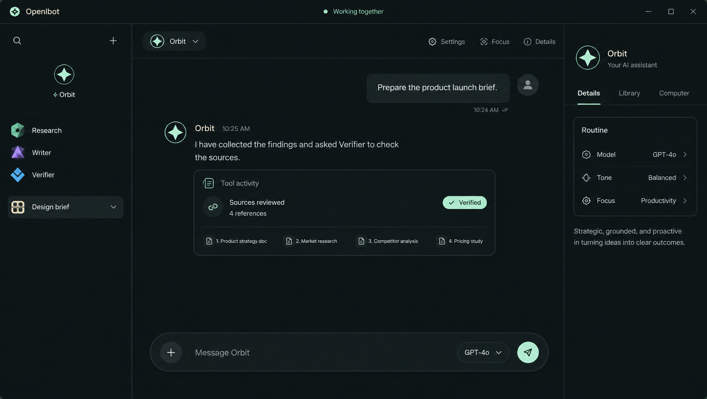
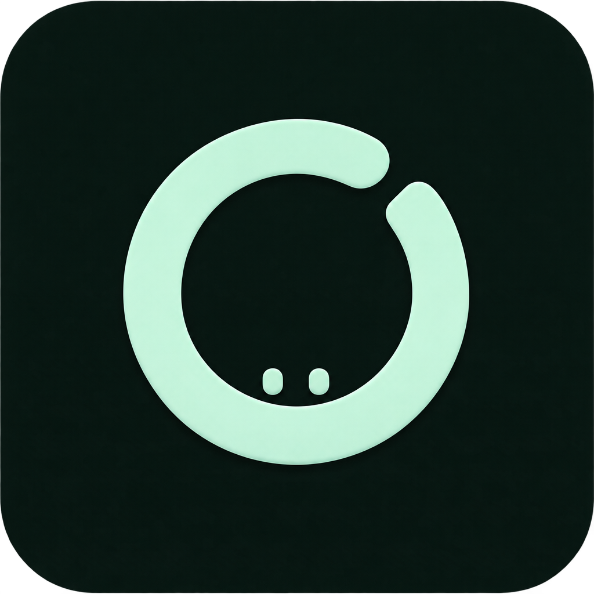

# OpenIbot — premium workspace design

This design gives the application its own identity: a mint open-ring mark on a forest-dark tile, calm green surfaces, warm ivory text, and precise system typography. It keeps the top search/create actions and flat bot list, with no welcome banner or preset-task menu.

## What was created with Higgsfield

Higgsfield generated the app icon and the desktop UI concept. A second icon generation refined the transparent outer corners. The concept is a visual reference: its example tasks, “Verified” badge and model labels are illustrative, not claims about real work or new app capabilities. The working interface displays actual saved messages, tools, routines and bot status.

The model was GPT Image 2.5 (`gpt_image_2_5`). Generation IDs: original icon `50d047cc-ff83-42ad-9dba-65e97bf2ba1f`, UI concept `5f603639-c0e1-4ee1-97ff-8b2a1fdad358`, final icon `56ff336d-6f92-40af-b79d-5c9d3a731313`. The three quoted generations cost four credits in total; the balance decreased from 28 to 24. No project or recurring generation was created.

## Palette

| Role | Dark | Light |
|---|---|---|
| Main workspace | `#0c1413` | `#f7faf6` |
| Panel | `#141f1d` | `#edf3ed` |
| Raised surface | `#1e2d28` | `#e1ece3` |
| Border | `#2b3d35` | `#cbd9cf` |
| Main text | `#f1f2e9` | `#1b3026` |
| Supporting text | `#a0afa7` | `#566e61` |
| Accent / primary button | `#b9e9ce` | `#285e44` |
| Primary button text | `#10281c` | `#f8fcf8` |

The base text/background, supporting-text/panel and primary-button pairs have contrast ratios of 16.55, 7.39 and 11.63 in dark mode; 13.33, 4.91 and 7.31 in light mode. These are palette checks, not a full accessibility audit. Disabled controls deliberately have reduced opacity. Keyboard focus remains visible, and existing motion preferences still control bot animations.

## Typography and layout

Use Segoe UI Variable or the available system sans-serif fallback. Keep titles compact and semibold rather than large decorative serif headings. Mint is for creation, focus, selection and actions; bot colors remain each identity’s saved appearance.

The sidebar keeps a pinned main bot and a single scrolling list. The selected row has a subtle mint fill and edge. The header actions sit in a compact surface. Assistant replies are open text for easier reading; user messages have contained bubbles. The composer has a delicate border, model pill and mint send control. Details tabs, routines, file cards, dialogs, Settings and Marketplace share the same palette.

## How the assets become part of the app

[The final master](openibot-icon-master.png) has transparent outer corners. Deterministic size/format conversion produces [assets/icon.png](../../assets/icon.png) at 256×256 and [assets/icon.ico](../../assets/icon.ico) with 16, 24, 32, 48, 64, 128 and 256 pixel images. Conversion does not paint or redesign the mark.

[renderer/premium.css](../../renderer/premium.css) loads the PNG in `.brand-mark`, replacing the earlier two-eye orange mark in the titlebar, boot view and About screen. Vite bundles it as a hashed local asset. [desktop/main.ts](../../desktop/main.ts) uses the PNG for the native window/tray; [package.json](../../package.json) uses the ICO for Windows builds. No generated-image service is contacted while using the installed app.

## Maintaining the design

Change shared CSS variables first so dark, light and system modes stay consistent. Check compact windows, long names, focused chat, dialogs and keyboard tabs. Keep operational labels tied to actual state; do not copy illustrative verification badges or fabricated activity from the concept. Retain users’ saved bot appearances and the existing profile path. Explain future changes in the [code change log](../code/CHANGELOG.md).
